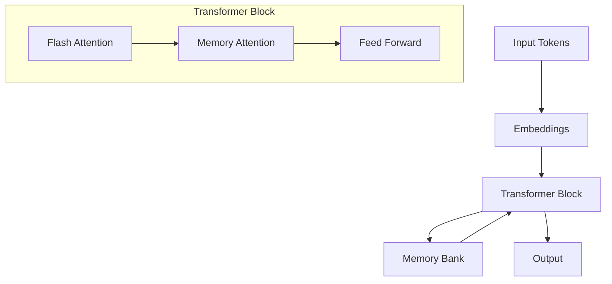
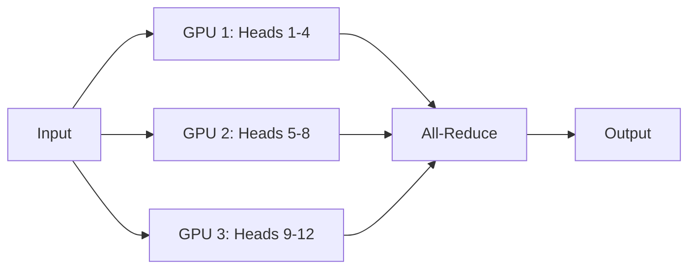
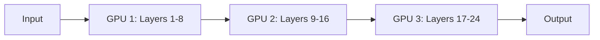

# LTM Transformer Architecture

This document describes the technical architecture of the LTM Transformer, focusing on its key components and their interactions.

## Overview

The LTM Transformer extends the standard Transformer architecture with a novel long-term memory mechanism inspired by Google's Titan. The system is designed to efficiently handle extended context windows while maintaining reasonable memory usage through compression and efficient attention mechanisms.

## System Components



### Core Components

1. **Memory Bank**
   - Stores compressed representations of past context
   - Dimensions: `[memory_slots × memory_dim]`
   - Updated through a gating mechanism
   - Persists across inference steps

2. **Compression Gate**
   - Compresses hidden states into memory representations
   - Uses learned parameters to determine importance
   - Implements selective update mechanism

3. **Memory Attention**
   - Efficient cross-attention between current context and memory
   - Optimized for sparse access patterns
   - Integrated with FlashAttention

4. **Flash Attention**
   - Memory-efficient attention implementation
   - Tiled matrix multiplication
   - Fused softmax operations

## Memory Management

### Memory Bank Design

```
Memory Bank Structure:
[M × D] matrix where:
- M: Number of memory slots (default: 512)
- D: Memory dimension (default: 64)
```

Memory slots are updated using a gating mechanism:

```python
# Pseudo-code for memory update
def update_memory(memory_bank, new_content, gate_values):
    # gate_values: [0,1] determining update importance
    memory_bank = (1 - gate_values) * memory_bank + gate_values * new_content
```

### Compression Mechanism

The compression gate uses a learned transformation:

```python
# Pseudo-code for compression
def compress_state(hidden_state):
    # Project to lower dimension
    compressed = self.compress_proj(hidden_state)
    
    # Generate importance scores
    scores = self.importance_scorer(compressed)
    
    # Apply gating
    gated = compressed * torch.sigmoid(scores)
    
    return gated
```

## Attention Mechanisms

### Flash Attention

Implements memory-efficient attention:

1. Block-wise computation to fit in fast memory
2. Fused operations to reduce memory access
3. Recomputation of attention if needed

```python
# Pseudo-code for flash attention
def flash_attention(Q, K, V):
    # Split into blocks that fit in SRAM
    for q_block in Q.blocks():
        for k_block, v_block in zip(K.blocks(), V.blocks()):
            # Compute attention for current block
            scores = scaled_dot_product(q_block, k_block)
            output = scores @ v_block
            
            # Accumulate results
            update_output(output)
```

### Memory Attention

Efficient attention between current context and memory bank:

```python
# Pseudo-code for memory attention
def memory_attention(query, memory_bank):
    # Project query to memory space
    query_proj = self.query_proj(query)
    
    # Compute attention scores
    scores = torch.matmul(query_proj, memory_bank.transpose(-2, -1))
    
    # Apply attention
    attended_memory = torch.matmul(scores, memory_bank)
    
    return attended_memory
```

## Parallel Processing

### Tensor Parallelism

Splits attention heads and feed-forward layers across GPUs:



### Pipeline Parallelism

Splits transformer layers across GPUs:



## Optimization Techniques

### Memory Optimizations

1. **Gradient Checkpointing**
   - Trades computation for memory
   - Selectively recomputes activations
   - Configurable granularity

2. **Mixed Precision Training**
   - FP16/BF16 for most operations
   - FP32 for critical computations
   - Dynamic loss scaling

3. **Kernel Fusion**
   - Combines multiple operations
   - Reduces memory bandwidth usage
   - Custom CUDA implementations

### Performance Optimizations

1. **Fused CUDA Kernels**
   ```cpp
   // Example of fused LayerNorm + Dropout + ReLU
   template <typename T>
   __global__ void fused_layernorm_dropout_relu(
       T* output,
       const T* input,
       const T* gamma,
       const T* beta,
       float dropout_prob,
       int n) {
       // Kernel implementation
   }
   ```

2. **Memory Access Patterns**
   - Coalesced memory access
   - Shared memory usage
   - Register-level optimizations

3. **Workload Balancing**
   - Dynamic batch sizing
   - Adaptive sequence lengths
   - Load-based scheduling

## Configuration

Example configuration:

```yaml
model:
  hidden_size: 768
  num_attention_heads: 12
  num_hidden_layers: 12
  memory_slots: 512
  memory_dim: 64
  
optimization:
  use_flash_attention: true
  use_memory_compression: true
  memory_compression_ratio: 0.5
  
training:
  mixed_precision: true
  gradient_checkpointing: true
  tensor_parallel_size: 4
  pipeline_parallel_size: 2
```

## Integration Points

### Python Bindings

```python
# High-level Python interface
class TitanModel:
    def __init__(self, config):
        self.core = TitanModelImpl(config)  # C++ implementation
        self.setup_memory_bank()
    
    def forward(self, input_ids):
        return self.core.forward(input_ids)
```

### C++ Core

```cpp
// Low-level C++ implementation
class TitanModelImpl {
    void forward(torch::Tensor input) {
        // Implementation
    }
    
    void update_memory(torch::Tensor new_content) {
        // Implementation
    }
};
```

## Performance Characteristics

### Memory Usage

| Operation              | Memory Complexity    | Optimization        |
|-----------------------|---------------------|-------------------|
| Standard Attention    | O(n²)               | -                 |
| Flash Attention      | O(n)                | Block-wise compute|
| Memory Bank          | O(m)                | m << n            |
| Memory Attention     | O(n×m)              | m << n            |

### Computational Complexity

| Operation              | Time Complexity      | Notes             |
|-----------------------|---------------------|-------------------|
| Standard Attention    | O(n²d)              | n: seq length     |
| Flash Attention      | O(n²d/B)            | B: block size     |
| Memory Compression   | O(nd)               | d: hidden dim     |
| Memory Attention     | O(nmd)              | m: memory slots   |

## Future Improvements

1. **Dynamic Memory Allocation**
   - Adaptive memory slot sizing
   - Content-based memory management
   - Memory pruning strategies

2. **Advanced Parallelism**
   - Sequence parallelism
   - Expert parallelism
   - Hybrid parallelism strategies

3. **Optimization Opportunities**
   - Sparse attention patterns
   - Adaptive precision training
   - Hardware-specific optimizations
